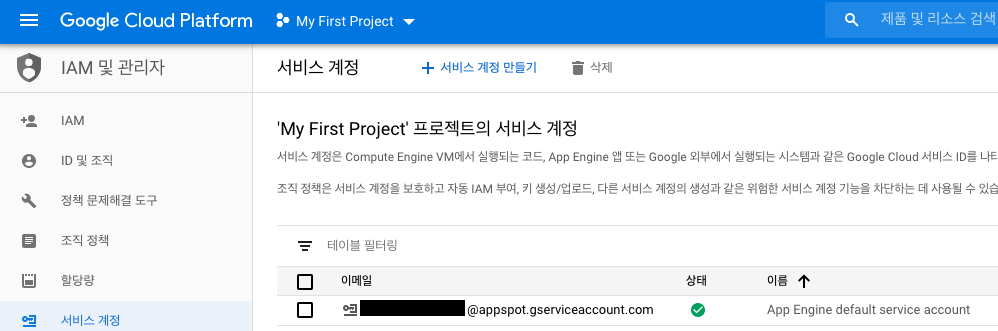
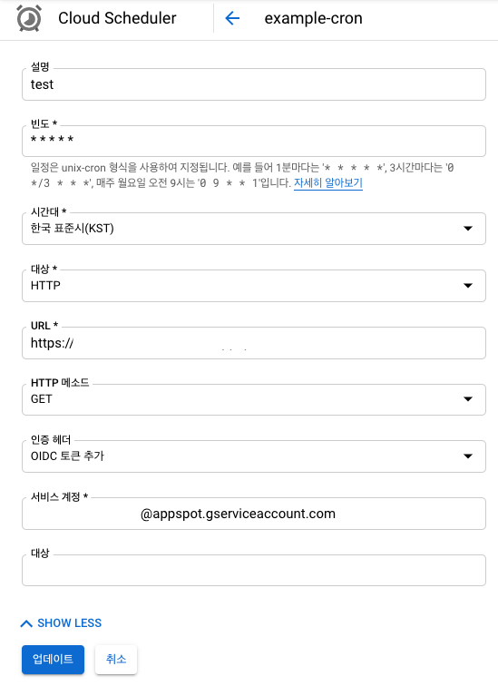

# Secure API call with GCP Cloud Scheduler
## Identify and existing service account
* IAM > Service Account
* Remember an email of service account
  * App Engine default service account (I used this account, when I was testing.)
  * Compute Engine default service account



## Create Cloud Scheduler
* Fill General forms.
* Press the SHOW MORE
* Auth Header : `Add OIDC token`
* Service account : `email of service account(see above)`


## Request Header
### Before add Auth Header
```
{ 
  host: 'abcdefg.du.r.appspot.com',
  'x-forwarded-for': '107.178.198.126, 169.254.1.1',
  'x-forwarded-proto': 'https',
  forwarded: 'for="107.178.198.126";proto=https',
  'x-cloudscheduler': 'true',
  'user-agent': 'Google-Cloud-Scheduler',
  'x-cloud-trace-context': '5e24df75fd05b524cf135493b70ce1b7/6160074212246828812;o=1',
  'x-appengine-country': 'ZZ',
  'x-appengine-https': 'on',
  'x-appengine-user-ip': '107.178.198.126',
  'accept-encoding': 'gzip,deflate,br',
  'x-appengine-request-log-id': '5ed9ae0900ff0d06082a4d09b70001767e6e74682d636972636c65742d3237393430310001323032303036303574313131373237000100',
  'x-appengine-default-version-hostname': 'abcdefg.du.r.appspot.com' 
}
```
### After add Auth Header
```
{ 
  host: 'abcdefg.du.r.appspot.com',
  'x-forwarded-for': '107.178.198.97, 169.254.1.1',
  'x-forwarded-proto': 'https',
  forwarded: 'for="107.178.198.97";proto=https',
  'x-cloudscheduler': 'true',
  authorization: 'Bearer JWT_TOKEN',
  'user-agent': 'Google-Cloud-Scheduler',
  'x-cloud-trace-context': 'd60f04aadeb8aed5f5f81c0d8c7db015/5258430344725939349;o=1',
  'x-appengine-country': 'ZZ',
  'x-appengine-https': 'on',
  'x-appengine-user-ip': '107.178.198.97',
  'accept-encoding': 'gzip,deflate,br',
  'x-appengine-request-log-id': '5ed9b30d00ff06220f1c6091380001767e6e74682d636972636c65742d3237393430310001323032303036303574313131373237000100',
  'x-appengine-default-version-hostname': 'abcdefg.du.r.appspot.com' 
}
```

## JWT Validation
* Google JWT Validation API : https://oauth2.googleapis.com/tokeninfo?id_token=[JWT]
* Valid case
```
{
	"aud": "https://abcdefg.du.r.appspot.com/",
	"azp": "1431234153452365346345",
	"email": "abcdefg@appspot.gserviceaccount.com",
	"email_verified": "true",
	"exp": "1591337880",
	"iat": "1591334280",
	"iss": "https://accounts.google.com",
	"sub": "116332858165058838810",
	"alg": "RS256",
	"kid": "adfasdfasdfsadfsdfasdfdsfsdf",
	"typ": "JWT"
}
```
* Invalid case
```
{
	"error": "invalid_token",
	"error_description": "Invalid Value"
}
```

## Sample code
### BE
* Add middleware before API call to verify JWT.
* Expected result : return `200`
* [See code](./app.js)

### Attack code
* Call API with customizing Headers.
* Expected result : return `401`
* [See code](./html/index.html)

## Reference
* [GCP Cloud Scheduler - Using authentication with HTTP Targets](https://cloud.google.com/scheduler/docs/http-target-auth)
* [Google Sign-In - Calling the tokeninfo endpoint](https://developers.google.com/identity/sign-in/web/backend-auth#calling-the-tokeninfo-endpoint)